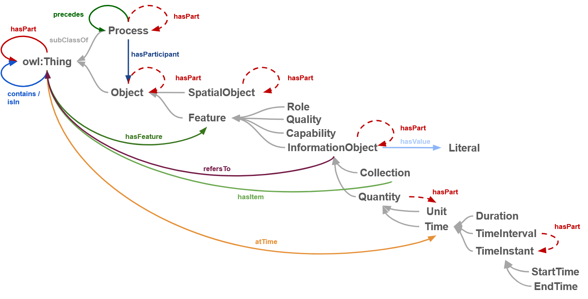

# sulo
The Simplified Upper Level Ontology

SULO is intended to provide a simplified set of classes and relations to guide the representation of knowledge in RDF/OWL.
SULO provides a simplified set of classes and relations to guide the representation of knowledge in RDF/OWL.

Documentation for SULO is available using:
* [OntoSpy](https://aidava-dev.github.io/sulo/)
* [Pylode](https://aidava-dev.github.io/sulo/pylode/sulo.html)

Here's the SULO Postcard showing all the classes and valid relations between them 

